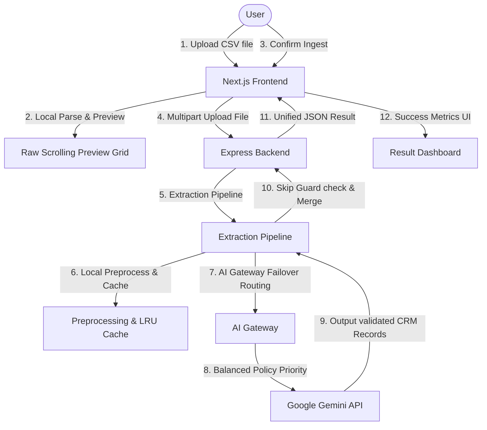

# GrowEasy CRM CSV Importer — Lead-Mapper

An AI-powered CSV lead importer that allows GrowEasy CRM users to upload any valid CSV format, preview the raw rows locally in the browser, and confirm the import to map messy columns intelligently into structured CRM records using Google Gemini.

---

## Technical Architecture Overview

The system uses a stateless architecture split into a Next.js frontend (deploys to Vercel Hobby) and a Node.js + Express backend (deploys to Render Free).



### Key Software Engineering Decisions
1. **TypeScript Cross-Stack**: Enforces compilation-level type checking on all data models.
2. **Backend-Owned Ingestion & AI Gateway**: The Express backend parses uploaded CSV streams, groups records into confidence bands, queries an LRU request cache, routes cache misses through the AI Gateway (incorporating retry fallback loops across 5 Gemini models), and returns a unified JSON payload.
3. **Double-Layer Skip Guard**: Rows missing both emails and phone numbers are classified as skip-eligible, skipping LLM calls entirely.
4. **Deterministic Preprocessing**: Executes fuzzy header matches, enums, dates, and phone number standardizations in 2ms, bypassing the AI API for clean CSV files.
5. **Dynamic Proxy Routing**: Built-in Next.js `proxy.ts` routes relative requests from the client to the API server, eliminating CORS preflight overhead.

---

## Directory Organization

```
Lead-Mapper/
├── docs/                                # Technical design & specifications
│   ├── 00-INDEX.md                      # Documentation entry registry
│   ├── 01-ARCHITECTURE.md               # Language, components, and module specifications
│   ├── 02-FOLDER-STRUCTURE.md           # Modular directory tree specifications
│   ├── 03-API.md                        # Request / Response JSON endpoint specifications
│   ├── 04-AI.md                         # AI Gateway, model registry, and prompt specs
│   ├── 05-TESTING.md                    # Test execution configurations
│   ├── 06-DEPLOYMENT.md                 # Infrastructure environment specifications
│   ├── 07-CODING-STANDARDS.md           # Style guides and conventions
│   ├── 08-IMPLEMENTATION-PLAN.md        # Milestones and CLI setup commands
│   ├── 09-DESIGN-SYSTEM.md              # Color tokens, typography, and motion scales
│   ├── 10-BRANDING.md                   # Brand visual guidelines and asset indexes
│   ├── 11-ACCESSIBILITY.md              # Aria attributes and keyboard trap navigation
│   ├── 12-PERFORMANCE.md                # Bundle sizes, asset auditing, and lazy limits
│   └── 13-SECURITY.md                   # Security headers, CSP, and upload filters
├── server/                              # Node.js + Express Backend
│   ├── src/
│   │   ├── config/                  # Environment variables loading
│   │   ├── features/importer/       # Importer feature controllers, routes, and validators
│   │   ├── shared/                  # Common AI Gateway modules, LRU caches, and middlewares
│   │   ├── app.ts                   # Express application setup
│   │   └── server.ts                # Server listener port binding
│   ├── tests/                           # Unit and Integration test suites
│   └── tsconfig.json
├── web/                                 # Next.js App Router Frontend
│   ├── public/                          # Brand logos, icons, and Open Graph assets
│   ├── src/
│   │   ├── app/                     # Next.js pages, layouts, manifests, and sitemaps
│   │   ├── features/importer/       # Importer upload dashboards, tables, and hooks
│   │   ├── proxy.ts                 # Next.js 16 dynamic proxy API rewrite router
│   │   └── shared/                  # Re-usable UI elements
│   └── tsconfig.json
└── submission-email.md                  # Final submission email package
```

---

## Local Setup & Quickstart

Ensure you have **Node.js v22.x or v24.x** installed.

### 1. Backend Setup
1. Open a terminal and navigate to the backend directory:
   ```bash
   cd server
   ```
2. Install packages:
   ```bash
   npm install
   ```
3. Create a `.env` file in the root of the `server/` directory and add your API keys:
   ```env
   PORT=5000
   NODE_ENV=development
   GEMINI_API_KEY=your_gemini_api_key_here
   ALLOWED_ORIGIN=http://localhost:3000
   ```
4. Start the backend:
   ```bash
   npm run dev
   ```
   The backend will start at `http://localhost:5000`.

### 2. Frontend Setup
1. Open a new terminal and navigate to the frontend directory:
   ```bash
   cd web
   ```
2. Install packages:
   ```bash
   npm install
   ```
3. Create a `.env.local` file in the root of the `web/` directory:
   ```env
   NEXT_PUBLIC_API_URL=http://localhost:5000
   ```
4. Start the frontend developer server:
   ```bash
   npm run dev
   ```
   Open `http://localhost:3000` in your web browser.

---

## Verification & Testing

### 1. Running Backend Tests
Execute unit and integration tests (built-in Node test runner):
```bash
npm run test --prefix server
```

### 2. Checking Test Coverage
Measure test coverage statistics:
```bash
npm run test:coverage --prefix server
```

### 3. Running Typecheck Compilation
Verify TypeScript compiles cleanly with zero errors:
```bash
npm run typecheck --prefix server
npm run typecheck --prefix web
```

### 4. Live API Verification (Sample Data Suite)
To run end-to-end extraction tests against the sample CSV files in `server/tests/sample-data/` calling the real Gemini API:
```bash
cd server
node --import tsx --env-file=.env tests/verify_live_api.ts
```
