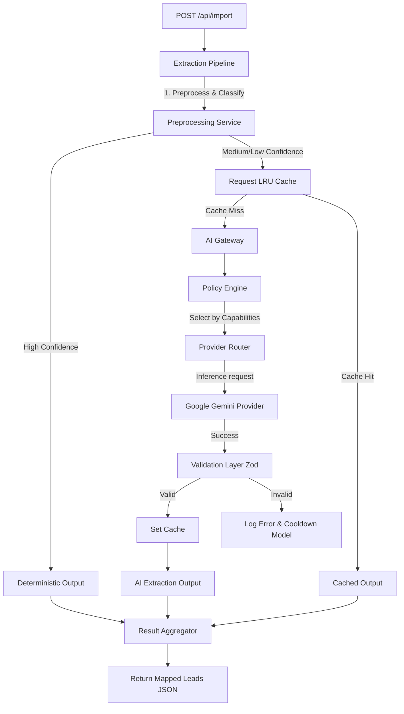

# 04 — AI Gateway & Ingestion Specification

### Status: **ARCHITECTURE FROZEN**

This document specifies the technical design, routing strategies, preprocessing logic, and request lifecycle for the Lead-Mapper AI layer.

---

## 1. AI Gateway Architecture Overview

The system replaces the single-model environment variable approach with a robust, policy-driven **AI Gateway** and an orchestrating **Extraction Pipeline**.



---

## 2. Core Modules & Responsibilities

### A. Extraction Pipeline (`server/src/shared/ai/extraction-pipeline.ts`)
The orchestrator of the ingestion lifecycle. It manages:
1. **Confidence Band Classification**: Splits records into High, Medium, or Low bands.
2. **Chunk Slicing**: Slices unresolved (Medium/Low confidence) records into batches of **20 rows** to maintain extraction accuracy.
3. **Cache Lookup**: Queries the LRU cache using SHA-256 batch hashes.
4. **Gateway Invocations**: Routes cache-miss batches to the AI Gateway.
5. **Post-Processing & Merging**: Validates schemas using Zod, applies the skip guard, and merges deterministic mappings with AI-enriched records.

### B. Preprocessing Service (`server/src/shared/ai/preprocessing.service.ts`)
Executes fast, deterministic normalizations before calling the LLM to save token costs and prevent quota limits:
* **Fuzzy Header Matching**: Uses Levenshtein distance calculations (similarity threshold > 0.85) to map messy columns (e.g. `'Primary E-mail Address'` -> `'email'`).
* **Validation & Normalization**: Normalizes dates to `YYYY-MM-DD HH:MM:SS`, phone numbers to standard format (extracts country codes), and maps standard enums (status, source).
* **Confidence Bands**:
  * **High Confidence**: Clean headers, standard values. Bypass AI completely (completed in 2ms).
  * **Medium Confidence**: Messy headers, irregular enums, multiple emails/phones, or swapped columns. Route to AI Gateway to resolve and merge.
  * **Low Confidence**: Missing header mappings or completely ambiguous column shapes.
* **Row Scan skip guard**: Scans all cells in a row for valid email/phone formats to support column-swapped rows and avoid premature skipping.

### C. Request Cache (`server/src/shared/ai/request-cache.ts`)
An in-memory Least Recently Used (LRU) cache protecting the API from redundant LLM invocations:
* **Hashing**: Computes a deterministic SHA-256 hash of stringified batch records (sorted by object keys).
* **Scope**: Caches **only** successful, Zod-validated response payloads. Failed or invalid responses are never cached.
* **Limits**: Evicts the oldest/least-recently-used item when cache size hits 500. Entries expire after a **10-minute TTL**.

### D. Policy-Driven Routing Engine (`server/src/shared/ai/policy-engine.ts`)
Resolves model priorities dynamically based on policy guidelines and registered model capability metadata:
* **Policies**:
  * `Balanced` *(Default)*: Prefers medium/high quality, fast speed, and healthy status (e.g. `gemini-3.1-flash-lite`).
  * `HighQuality`: Prefers high-parameter models and structured output support (e.g. `gemini-2.5-flash`).
  * `HighThroughput`: Prefers lowest-latency models.
  * `EmergencyFallback`: Disregards cooldown filters, sorting all models purely by health score.

---

## 3. Provider Abstraction & Model Registry

We isolate the provider implementation to easily allow multi-provider expansions in the future:

```typescript
export interface AiProvider {
  id: string; // e.g. 'google'
  name: string;
  callModel(modelId: string, prompt: string, systemInstruction: string, responseSchema: any): Promise<string>;
}
```

### Model Registry & Health Tracking (`server/src/shared/ai/model-registry.ts`)
Maintains a dynamic list of models and tracks health statistics in memory:
* **Registered Models**: `gemini-3.1-flash-lite`, `gemini-2.5-flash-lite`, `gemini-2.5-flash`, `gemini-2.0-flash`, `gemini-3.5-flash`.
* **Health System**:
  * Tracks consecutive failures, average latency, and cooldown timestamps.
  * Captures error logs by category: Quota (`429`), Timeout (`408`), Schema mapping errors, and Transient network failures.
  * Computes a dynamic **Health Score** (0 to 100). When a model fails, it suffers health score penalties and is placed on cooldown (5 minutes in production, 1.2 seconds in test runs).

---

## 4. Smart Retry & Fallback Flow
1. **Transient Failures** (e.g. timeout, network drop): Retries up to 2 times within the *same* model using exponential backoff.
2. **Quota / Severe 503 Failures**: Skips the retry loop, marks the model on cooldown, and immediately fails over to the next priority model resolved by the Policy Engine.
